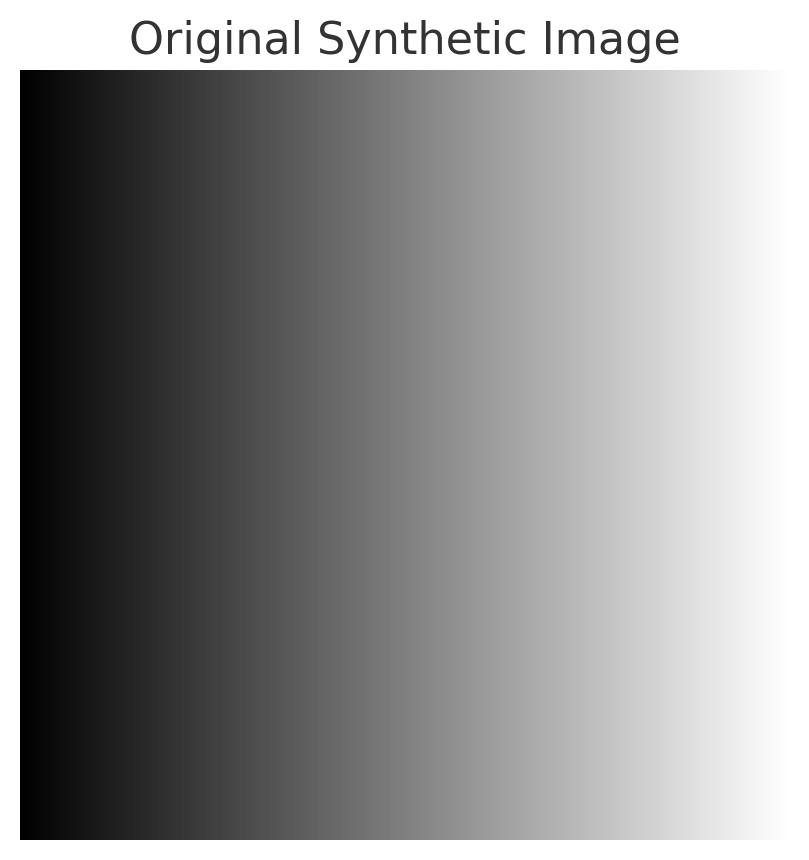

# Point Filtering in Image Processing

## Overview
Point filtering processes images at the pixel level independently of neighboring pixel values. These operations focus on modifying the intensity of individual pixels and are often used for:
- Contrast enhancement
- Thresholding
- Intensity transformations
- Brightness and contrast adjustments
- Image inversion (X-ray effect)

Since each pixel is processed individually without considering adjacent pixels, point filtering operations are computationally efficient and widely used in real-time image processing.

## Mathematical Transformations in Point Filtering

### 0. Original image
This is a sample synthetic image.

### 1. Brightness Adjustment
To adjust the brightness of an image, a constant value is added to each pixel:

\[
I' = I + C
\]

where:
- \( I \) is the original pixel intensity.
- \( C \) is the brightness adjustment constant (positive for brightening, negative for darkening).
- \( I' \) is the new pixel intensity.

**Example:**

### 2. Darkening the Image
Darkening is achieved by subtracting a constant from pixel intensities:

\[
I' = I - C
\]

**Example:**

### 3. Contrast Adjustment
Contrast adjustment involves scaling pixel intensity values:

\[
I' = \alpha I
\]

where:
- \( \alpha \) is a scaling factor (\( \alpha > 1 \) increases contrast, \( \alpha < 1 \) decreases contrast).

**Example:**

### 4. Non-Linear Contrast Transformations
Non-linear transformations can enhance contrast in specific intensity ranges:
- **Power-Law (Gamma Correction):**

  \[
  I' = I^{\gamma}
  \]
  where \( \gamma \) is the gamma correction exponent (\( \gamma > 1 \) darkens, \( \gamma < 1 \) brightens).

- **Logarithmic Transformation:**

  \[
  I' = c \log(1 + I)
  \]
  where \( c \) is a scaling constant.

**Example:**

### 5. Image Inversion (X-ray Effect)
To create a negative (X-ray-like) effect, pixel values are inverted:

\[
I' = 255 - I
\]

This transformation highlights differences in intensity and is often used in medical imaging.

**Example:**

### 6. Thresholding
Thresholding converts a grayscale image into a binary image:

\[
I' = \begin{cases} 
0, & I < T \\
255, & I \geq T 
\end{cases}
\]

where:
- \( T \) is the threshold value.
- Pixels above \( T \) become white (255), and pixels below become black (0).

**Example:**

## Applications of Point Filtering
- **Medical Imaging:** Enhancing contrast in X-ray or MRI scans.
- **Image Binarization:** Converting scanned documents into black-and-white.
- **Adaptive Display Processing:** Adjusting brightness and contrast for display calibration.
- **Preprocessing in Computer Vision:** Preparing images for object detection and recognition.

Point filtering operations are foundational techniques in image processing, offering efficient ways to manipulate image intensities for various applications.

