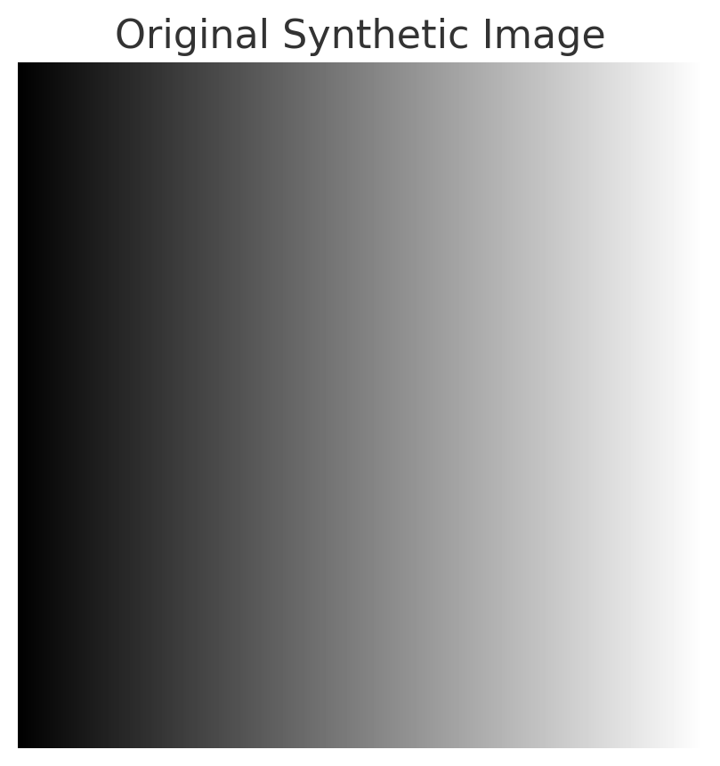
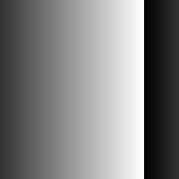
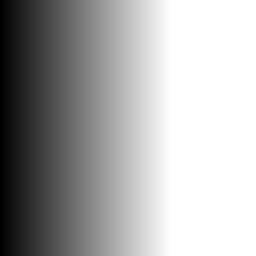
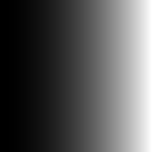
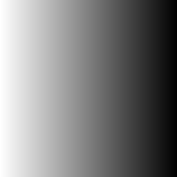

# Module 02 — Point Operations: Brightness, Contrast, Gamma and Thresholding

Point operations transform each pixel independently. They are a good first computer-vision lesson because the math is simple enough to inspect by hand, yet the same ideas appear in camera preprocessing, display pipelines, segmentation, exposure handling, and neural-network input preparation.

This lesson is the first **video-ready reference lesson** in the 9x Computer Vision course.

## Learning objectives

After this lesson you should be able to:

- explain a point operation as a function `output = f(input)`
- distinguish brightness offset from contrast scaling
- explain clipping/saturation in 8-bit images
- implement gamma correction with a lookup table
- explain binary threshold behavior at the threshold boundary
- build and run the C++ example from any working directory
- validate the implementation with deterministic pixel-level checks

## Prerequisites

- basic C++
- an Ubuntu/Linux environment with OpenCV 4
- the repository build described in [`BUILDING.md`](../../BUILDING.md)

## Input image

The repository includes a synthetic grayscale image so the transformations are easy to see:



The C++ program does **not** hard-code this path. Any readable image can be supplied with `--input`.

## 1. Brightness

A brightness offset adds a constant to every pixel:

\[
I_{out} = \operatorname{sat}(I_{in} + \beta)
\]

`beta > 0` brightens the image and `beta < 0` darkens it. `sat()` means values are saturated to the representable 8-bit range `[0, 255]`.

For example, with `beta = 50`:

- 20 becomes 70
- 240 would mathematically become 290, but an 8-bit output clips to 255



## 2. Contrast

A simple contrast transform scales intensity:

\[
I_{out} = \operatorname{sat}(\alpha I_{in})
\]

- `alpha > 1` spreads intensities away from zero and increases contrast for this simple model
- `0 < alpha < 1` compresses them
- values above 255 saturate



In production imaging pipelines, contrast is often adjusted around a chosen midpoint rather than zero. That is a useful extension exercise after understanding the basic form.

## 3. Gamma correction

The implementation in this lesson uses:

\[
I_{out} = 255\left(\frac{I_{in}}{255}\right)^{\gamma}
\]

For this convention:

- `gamma < 1` brightens many mid-tone values
- `gamma > 1` darkens them



The implementation precomputes all 256 possible 8-bit results in a lookup table and then applies the table with `cv::LUT`. This is preferable to evaluating `pow()` independently for every pixel when the input domain is only 256 values.

> Gamma terminology varies between imaging systems. Some APIs or standards describe encoding/decoding using the reciprocal exponent. Always state the equation being implemented rather than relying only on the word "gamma."

## 4. Inversion

For an 8-bit grayscale image:

\[
I_{out} = 255 - I_{in}
\]

Examples:

- 0 becomes 255
- 64 becomes 191
- 255 becomes 0



## 5. Binary thresholding

The C++ example uses OpenCV `THRESH_BINARY`:

\[
I_{out} =
\begin{cases}
0, & I_{in} \le T \\
255, & I_{in} > T
\end{cases}
\]

Notice the exact boundary: a pixel equal to `T` becomes 0 for `THRESH_BINARY`.


## C++ implementation

Source:

[`03_TransformationInCpp/pointfiltering.cpp`](03_TransformationInCpp/pointfiltering.cpp)

Build from the repository root:

```bash
cmake -S . -B build -DCMAKE_BUILD_TYPE=Release
cmake --build build --target cv9x_point_filter
```

Run using the repository sample image:

```bash
./build/cv9x_point_filter \
  --input 02_ImageFiltering/01_PointFiltering/01_Images/SyntheticImage_Base.png \
  --output-dir build/point_filter_results
```

The program writes:

```text
brightness_adjustment.png
contrast_adjustment.png
darkening.png
gamma_correction.png
image_inversion.png
thresholding.png
```

You can change the parameters directly from the CLI:

```bash
./build/cv9x_point_filter \
  --input my_image.jpg \
  --output-dir build/my_results \
  --brightness 30 \
  --darken 30 \
  --contrast 1.25 \
  --gamma 0.8 \
  --threshold 140
```

Show all options:

```bash
./build/cv9x_point_filter --help
```

## Deterministic validation

A vision demo should not be considered correct only because the output "looks right." This lesson includes a small in-memory pixel test:

```bash
./build/cv9x_point_filter --self-test
```

Or run it through CTest:

```bash
ctest --test-dir build --output-on-failure
```

The test uses a known five-pixel input:

```text
0, 64, 128, 192, 255
```

and checks exact expected values for brightness, contrast, gamma, inversion, and thresholding. CI runs the same test on Linux.

## Engineering notes

### Saturation is part of the algorithm

With 8-bit output, arithmetic cannot be treated as unbounded integer math. Brightening 250 by 20 should produce 255 in this implementation, not wrap around to a small value.

### Avoid working-directory assumptions

The earlier version of this example used a relative hard-coded input filename. That makes a program succeed or fail depending on where it is launched. The current executable takes explicit input and output paths so it behaves consistently from scripts, CI, IDEs, and terminals.

### Grayscale simplifies the first lesson

The executable reads the input as grayscale. The same point operations can be applied per channel to color images, but doing so raises additional questions about color spaces and whether an operation should modify RGB channels or luminance only. Those topics belong in the image-formation/color module.

### A LUT is a useful embedded pattern

For an 8-bit domain, a nonlinear transform has only 256 possible input values. Computing the transform once and using a lookup table trades a tiny amount of memory for predictable repeated processing.

## Common failure cases

- input image path is wrong or unreadable
- output directory cannot be created
- gamma is zero or negative
- threshold is outside `[0, 255]`
- aggressive brightness/contrast settings cause clipping and lose information
- applying intensity operations independently to RGB channels can alter perceived color

The executable validates the CLI parameters and returns a non-zero exit status on invalid input.

## Exercises

1. Add a contrast transform around a midpoint:

   \[
   I_{out} = \operatorname{sat}(\alpha(I_{in}-m)+m)
   \]

   Compare `m = 0` with `m = 128`.

2. Add a logarithmic transformation and include it in `--self-test`.

3. Run the program with gamma values `0.5`, `1.0`, and `2.0`. Explain the difference using the equation rather than only the resulting images.

4. Extend the program to preserve a color input and apply brightness to luminance in a color space such as YCrCb. Compare the result with modifying each BGR channel directly.

## Video lesson

The recording outline, commands, chapter structure, and YouTube description are in [`VIDEO.md`](VIDEO.md).
