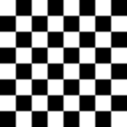

# Gaussian Filter in Image Processing

## Overview
The Gaussian filter is a neighborhood-based image processing operation that smooths an image by applying a Gaussian function as a convolution kernel. Unlike the box filter, which uniformly averages pixel values, the Gaussian filter assigns different weights to surrounding pixels based on a Gaussian distribution, giving more importance to the central pixel and less to distant pixels.

This results in a natural, visually appealing blur that preserves edges better than a box filter.

## Mathematical Representation
A two-dimensional Gaussian function is defined as:

$$
G(x, y) = \frac{1}{2 \pi \sigma^2} e^{- \frac{x^2 + y^2}{2 \sigma^2}}
$$

where:
- \( G(x, y) \) is the weight assigned to the pixel at position \( (x, y) \).
- \( \sigma \) (sigma) is the standard deviation of the Gaussian distribution, which controls the degree of blurring.
- \( x \) and \( y \) are the distances from the center pixel.

Example:  This is a sample synthetic image.

### Example Gaussian Kernels
#### 3x3 Gaussian Kernel with \( \sigma = 1.0 \):
$$
\frac{1}{16} \begin{bmatrix} 
1 & 2 & 1 \\ 
2 & 4 & 2 \\ 
1 & 2 & 1 
\end{bmatrix}
$$

Example: 

#### 5x5 Gaussian Kernel with \( \sigma = 1.4 \):
$$
\frac{1}{256} \begin{bmatrix} 
1 & 4 & 6 & 4 & 1 \\ 
4 & 16 & 24 & 16 & 4 \\ 
6 & 24 & 36 & 24 & 6 \\ 
4 & 16 & 24 & 16 & 4 \\ 
1 & 4 & 6 & 4 & 1 
\end{bmatrix}
$$

Example: 

## Effects of Gaussian Filtering
- **Blurring:** Smooths images while maintaining better edge structures than a box filter.
- **Noise Reduction:** Helps reduce high-frequency noise while preserving significant details.
- **Preprocessing for Edge Detection:** Used in algorithms like Canny Edge Detection to reduce noise before detecting edges.
