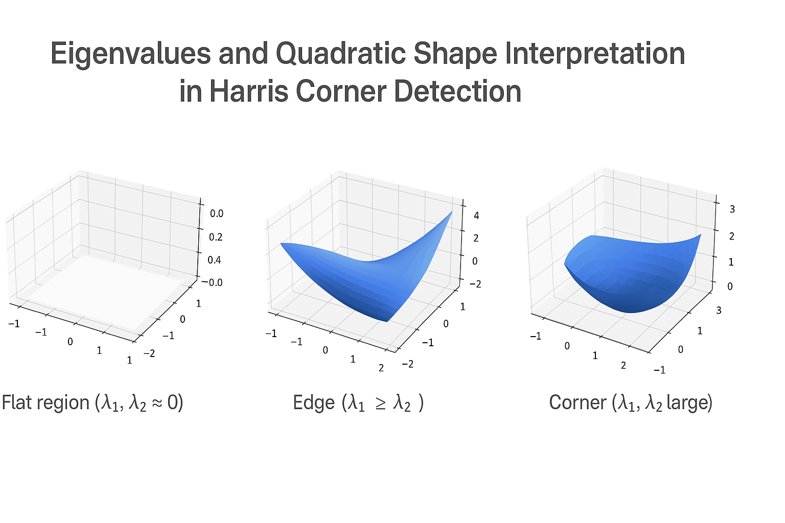

# Eigenvalues and Quadratic Shape Interpretation in Harris Corner Detection

## Overview
In Harris Corner Detection, the third step involves interpreting the **eigenvalues of the covariance matrix** (also known as the structure tensor). These eigenvalues give insights into how the intensity of an image patch changes with respect to small shifts, helping to classify regions as corners, edges, or flat.

---

## Covariance Matrix Recap
The covariance matrix \( M \) for an image patch is defined as:

\[
M = \sum w(x, y) \begin{bmatrix} I_x^2 & I_x I_y \\ I_x I_y & I_y^2 \end{bmatrix}
\]

Where:
- \( I_x \) and \( I_y \) are the gradients in the x and y directions.
- \( w(x, y) \) is a Gaussian window.

This matrix summarizes the gradient structure of the image in a local region.

---

## Eigenvalues and What They Mean
Let the eigenvalues of \( M \) be \( \lambda_1 \) and \( \lambda_2 \).
They represent the amount of intensity variation along two orthogonal directions.

### Shape Interpretation Based on Eigenvalues:
| Region Type | \( \lambda_1 \), \( \lambda_2 \)             | Error Function Shape | Description                  |
|-------------|----------------------------------|----------------------|------------------------------|
| Flat        | Both small                      | Flat Plane           | Little to no change in any direction |
| Edge        | One large, one small            | Ridge (Taco-like)    | Change in one direction only       |
| Corner      | Both large                      | Bowl (Elliptical Peak) | Change in all directions         |

These shapes reflect the 2D quadratic surface created by:
\[
E(u, v) = \begin{bmatrix} u & v \end{bmatrix} M \begin{bmatrix} u \\ v \end{bmatrix}
\]

- **Flat**: Both eigenvalues are near 0 → surface is flat
- **Taco** (ridge): One eigenvalue is large → change is prominent in one direction
- **Bowl**: Both eigenvalues are large → curvature in both directions (corner)

---

## Error Function as a Quadratic Form
This error surface describes how the intensity changes with a shift vector \( (u, v) \). It takes the shape of a 2D paraboloid whose curvature is determined by \( \lambda_1 \) and \( \lambda_2 \).

### Visual Analogy:
- A **bowl** shape = corner (high variation in all directions)
- A **ridge** or **taco** shape = edge (variation in one direction)
- A **flat** surface = flat region (low variation in all directions)

### Example Illustration:

This image illustrates how eigenvalues affect the shape of the quadratic error surface:
- **Flat surface** = no response to movement
- **Ridge** = strong response in one direction
- **Bowl** = strong response in all directions

> 💡 For interactive or animated visuals, consider including a GIF or 3D surface viewer.

---

## Why Eigenvalues Matter
Instead of explicitly computing eigenvalues, the Harris detector simplifies the math with:
\[
R = \det(M) - k (\text{trace}(M))^2
\]
But for interpretation and visualization, directly analyzing \( \lambda_1 \) and \( \lambda_2 \) helps explain the behavior and geometric shape of local regions.

---

## What’s Next?
The next logical step is to:
1. Compute eigenvalues for a patch in code.
2. Visualize their magnitude.
3. Classify the region based on their ratio and value.

We’ll use this to interpret how the structure tensor leads to actual corner detection in practice.

---

## Summary
Eigenvalues of the covariance matrix reflect the directional intensity changes of an image patch:
- Large in both directions → **corner** (bowl-like shape)
- Large in one direction → **edge** (taco/ridge shape)
- Small in both → **flat** (plane)

These help shape the **error function**, letting us geometrically interpret patch behavior and robustly detect corners in an image.

