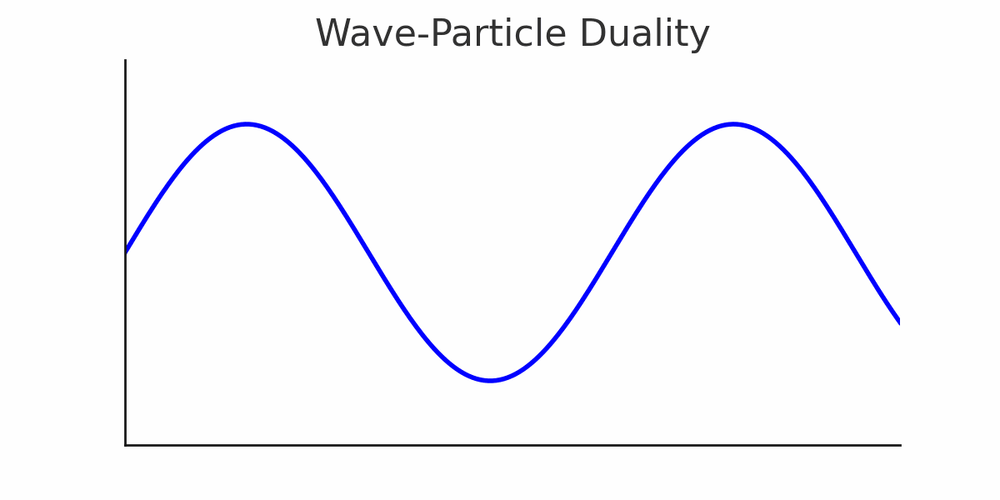
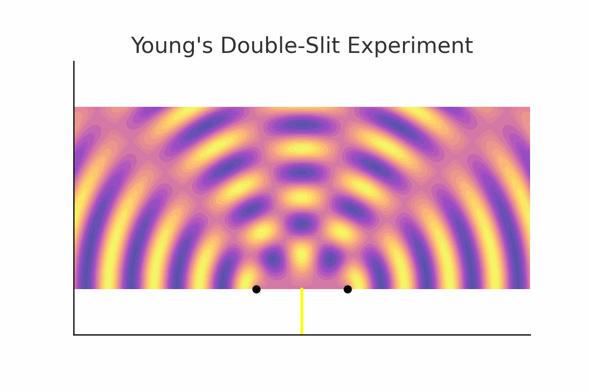

# Light: A Comprehensive Overview

## 1. What is Light?
Light is an electromagnetic wave composed of oscillating electric and magnetic fields perpendicular to each other and the direction of wave propagation.
(https://commons.wikimedia.org/wiki/File:EM-Wave.gif; Gif taken from here)

The electric field (E) and magnetic field (B) propagate through space, carrying energy and momentum. Light does not require a medium and can travel through a vacuum.

## 2. Is Light a Wave or a Particle?
Light exhibits both wave-like and particle-like properties, depending on how it is observed. This is known as **wave-particle duality**.

### Frequency, Wavelength, and Location
- **Frequency (ν)**: Number of oscillations per second (Hz).
- **Wavelength (λ)**: Distance between successive wave crests (m).
- **Heisenberg's Uncertainty Principle**:
  \[ \Delta x \Delta p \geq \frac{h}{2} \]
  This principle states that the more precisely the position (\(x\)) of a photon is known, the less precisely its momentum (\(p\)) can be determined, and vice versa.

## 3. Wave Interference and Fringes
Interference occurs when two or more waves overlap, leading to **constructive** (bright) and **destructive** (dark) fringes.

### **Young's Double-Slit Experiment**
One of the most famous experiments demonstrating the wave nature of light.

When light passes through two closely spaced slits, an interference pattern appears on the screen.

## 4. Properties of Light and the Light Spectrum
### Energy of Light
\[ E = \frac{hc}{\lambda} \]
where:
- \( E \) = Energy of a photon
- \( h \) = Planck's constant
- \( c \) = Speed of light
- \( \lambda \) = Wavelength of light

### Point Source Casting Shadows
A point light source creates sharp shadows, but due to diffraction and reflection, light rays cannot always be traced back to their source.

## 5. Pin-Hole Camera
A pin-hole camera is a simple optical device that projects an inverted image of an object onto a surface through a small aperture.

### What if the Hole is Not Infinitely Small?
- A larger hole causes blurring due to overlapping light rays.
- An extremely small hole leads to diffraction, reducing image clarity.

## 6. Lenses and Optics
Lenses focus or diverge light rays based on their curvature.

### Convex and Concave Lenses
- **Convex Lens (Converging)**: Focuses light to a point.
- **Concave Lens (Diverging)**: Spreads light rays outward.

### Lens Formula:
\[ \frac{1}{f} = \frac{1}{d_o} + \frac{1}{d_i} \]
where:
- \( f \) = Focal length
- \( d_o \) = Object distance
- \( d_i \) = Image distance

### Image Formation by a Convex Lens

When an object is placed at different distances, the image can be real and inverted or virtual and upright.

---
This document provides an introduction to the nature of light, its duality, wave interference, and fundamental optics concepts, with illustrations aiding understanding.

